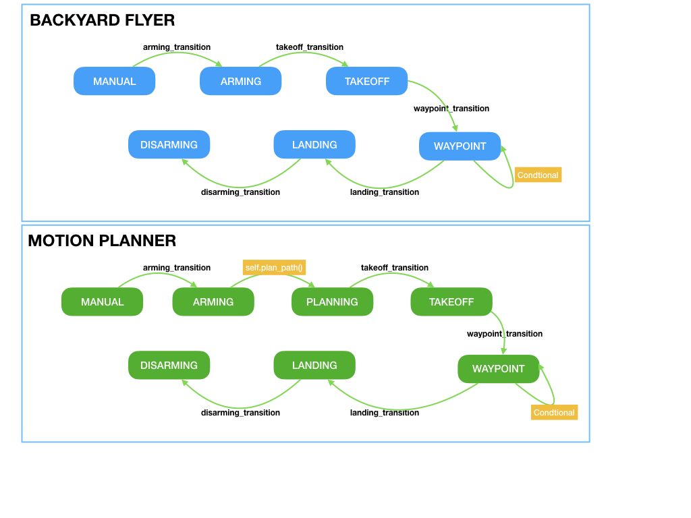

# RUBRIC Writeup

The writeup is an explanation of code changes and answers to Rubrik Questions to implement the FCND project, Motion Planning. 

## 1. Explain the starter code.
Test that motion_planning.py is a modified version of backyard_flyer_solution.py for simple path planning. Verify that both scripts work. Then, compare them side by side and describe in words how each of the modifications implemented in motion_planning.py is functioning.

### Answer:     
- To start with. There are few more imports of packages in the new motion_planning, especially the planning_utils is useful as it provides the a_star and heuristic function used in the Motion_planning as to plan a path

- Second the enumeration states are different, the motion planning provides one additional state, namely, PLANNING and all states have the value auto() instead of a default number. auto() means that an exact value is unimportant. 

The video "Phases of Flight" explains the phases (states) in a comprehensive way. I hope that the image is an reasonable attempt to explain the difference between the backyard-flyer and the motion_planner. The biggest difference can be found with the extra state, PLANNING. The ideas is that we don't have to fly in a hard coded box, but instead we can define a start and goal and the search function will provide flight plan (see code ==>  plan_path ) 

## 2. Implementing your planning Algorithm
## Home Position
In the starter code, we assume that the home position is where the drone first initializes, but in reality you need to be able to start planning from anywhere. Modify your code to read the global home location from the first line of the colliders.csv file and set that position as global home (self.set_home_position())

### Answer: Home Position
- Read first line of the colliders,csv file and extract lat0, lon0 as floating point values. 
- use the `self.set_home_position()` methof to set global home
