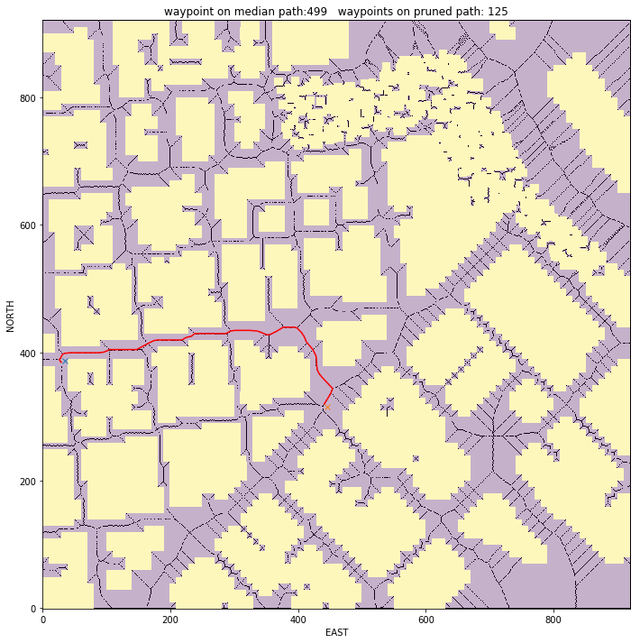

### RUBRIC Writeup

The writeup is an explanation of code changes and answers to Rubrik Questions in the project, __*Motion Planning*__. 

### 1. Very brief explanation of starter code.
_Test that motion_planning.py is a modified version of backyard_flyer_solution.py for simple path planning. Verify that both scripts work. Then, compare them side by side and describe in words how each of the modifications implemented in motion_planning.py is functioning._

##### Answer:     
- To start with, a few more packages are imported in the new motion_planning, especially the planning_utils is useful as it provides the a_star and heuristic function used in the Motion_planning as to plan a path

- Second the enumeration states are different, the motion planning provides one additional state, namely, PLANNING and all states have the value auto() instead of a default number. 
auto() means that an exact value is unimportant. 

The video "Phases of Flight" is an comprehensive explanation of different flight phases (states). The image below is (hopefully) a reasonable attempt to show the difference between the diferent states used in the backyard-flyer and the motion_planner. The biggest difference is found with the extra state, "PLANNING". The ideas is that we don't fly in a hard coded box, but instead we can define a "GOAL" and the search function will provide a flight plan (see code ==>  plan_path ) 

### 2. Implementing your planning Algorithm
#### Home Position
_In the starter code, we assume that the home position is where the drone first initializes, but in reality you need to be able to start planning from anywhere. Modify your code to read the global home location from the first line of the colliders.csv file and set that position as global home (self.set_home_position())_

##### Answer: Home Position
- Read first line of the colliders,csv file and extract lat0, lon0 as floating point values. 

       `with open(colliders_file) as f:
            latlon = f.readline().strip().split(',')
            lat0 = float(latlon[0].strip().strip('lat0'))
            lon0 = float(latlon[1].strip().strip('lon0'))`
            
- set global home ==> `self.set_home_position(lat0, lon0, 0)`

Although the first line is split in a LAT-LON, the float seems to truncate the last zero. Meaning `float(-122.397450)` is returned as `-122.39745`. in order to avoid this the latlon is hardcoded. I will investigate after the project submission how I can extract the lat lon and convert it to a float where the trailing `0` is not truncated.

#### Retrieve current position
_In the starter code, we assume the drone takes off from map center, but you'll need to be able to takeoff from anywhere. Retrieve your current position in geodetic coordinates from_

`self._latitude` 
`self._longitude` 
`self._altitude`

Then use the utility function `global_to_local()` to convert to local position (using `self.global_home` as well, which you just set)_

##### Answer: Retrieve current position
Determine the local position relative to global home
`global_to Local()` is a function you can find in frame_utils.py (udacidrone)

1. get easting and northing of global home
        `(east_home, north_home, _, _) = utm.from_latlon(self.global_home[1],self.global_home[0])`
        
2. get easting and northing of global position
        `(east, north, _, _) = utm.from_latlon(global_position[1],global_position[0])`
        
3. create a local position from global and home positions
        `local_position = numpy.array([north - north_home, east - east_home, -global_position[2]])`

the function glocal_to_local() requires two parameters. The first one is the global_position and the second is the global_home. The geodetic position is retrieved from `self._latitude, self._longitude and self._altitude` (self.global_home can be used instead)

        
#### change start point
_In the starter code, the start point for planning is hardcoded as map center. Change this to be your current local position._

##### Answer: start point
Two additional variables, the __*north_offset*__ and __*east_offset*__ are defined upon running the function `grid_creation`. Both are required to specifiy the start position on the grid. the start position is basically -offset + local_position
        
`grid_start = (-north_offset + int(self.local_position[0]), -east_offset + int(self.local_position[1]))`

#### Set goal position
_In the starter code, the goal position is hardcoded as some location 10 m north and 10 m east of map center. Modify this to be set as some arbitrary position on the grid given any geodetic coordinates (latitude, longitude)_

##### Answer: Set goal Position
The goal can be any __lat, lon__ rendered (using global_to_local()) to a goal location on the grid. 

1. set latitude,    `goal_lat = float(37.795240)`
2. set longitude,   `goal_lon = float(-122.393136)`
3. use global_to_local to convert the latlon into local NED
                    `goal_position = global_to_local((goal_lon,goal_lat,0),self.global_home)`
4. set the grid_goal by adding the offset values
                    `grid_goal = (-north_offset + int(goal_position[0]), -east_offset + int(goal_position[1]))`

##### Some pre-defined goal positions are defined
###### first path from center to point 1
|                         | from start to point1  |
|------------------------ | :--------------------:|
| Goal Lattitude          | lat: 37.795240        |
| Goal Longitude.         | lon: -122.393136      |
| Start (local)           | [316 445]             |
| Goal (local)            | [626 820]             |
| waypoints median path.  | 865                   |
| waypoints pruned path.  | 149                   |

###### second path from point 1 to point 2
|                         | from point1 to point2 |
|------------------------ | :--------------------:|
| Goal Lattitude          | lat: 37.796874        |
| Goal Longitude.         | lon: -122.399683      |
| Start (local)           | [626 820]             |
| Goal (local)            | [820 250]             |
| waypoints median path.  | 757                   |
| waypoints pruned path.  | 144                   |

###### third path from point 2 to point 3
|                         | from point2 to point3 |
|------------------------ | :--------------------:|
| Goal Lattitude          | lat: 37.793155        |
| Goal Longitude.         | lon: -122.402035     |
| Start (local)           | [820 250]             |
| Goal (local)            | [388 35]             |
| waypoints median path.  | 654                   |
| waypoints pruned path.  | 125                   |

###### third path from point 3 back to center
|                         | from point2 to point3 |
|------------------------ | :--------------------:|
| Goal Lattitude          | lat: 37.792480        |
| Goal Longitude.         | lon: -122.397450     |
| Start (local)           | [388 35]             |
| Goal (local)            | [316 445]             |
| waypoints median path.  | 514                   |
| waypoints pruned path.  | 89                   |

#### Search Algorithm A*
`create_grid()` is used to create a grid with a fixed __ALTITUDE__ and __SAFETY_DISTANCE__. the output of the function is a grid and a north and east offset

`grid, north_offset, east_offset = create_grid(data, TARGET_ALTITUDE, SAFETY_DISTANCE)`

The grid space (or configuration space) is given a map of the city, where obstacles are defined by reading a csv file that holds collison data. A medial axis of free space is defined and expresses a line layout between obstacles

`skeleton = medial_axis(invert(grid))`

We now have a start, goal position, a grid and medial path. The start and goal isn't necessary defined at the medial axis. 
The function `find_start_goal()` moves the points to the nearest postion on the medial axis

`skel_start, skel_goal = find_start_goal(skeleton, grid_start, grid_goal)`

we are now ready to search a path using A-star. 

`median_path, cost = a_star(invert(skeleton).astype(np.int), 
                            heuristic_func, 
                            tuple(skel_start), 
                            tuple(skel_goal))  `

A star uses a PriorityQueue which is basically an ellegant way of working with normal queue, where the queue is a data structure that is used to decide the order of the processing locations. The locations are two tuples, one for the start and one for the goal. 
instead of searching in order of first in, first out, it's better to keep track of the cost of each search. 
The function `valid_actions()` searches the grid in the direction N,E,W,S and additionally NE, SE, SW, NW for diagonal movement.

A medial path is returned with lots of waypoints, and in order to illimenate some points, path pruning is added. 

#### Cull waypoints
In the path pruning `prune_path()`, 3 points are checked to see if the points are not in line. If the point are in line than the 2nd (middle) point is removed. We use a method called `collinearity()` with an epsilon to determine if points are close enough to consider to be in line.

#### FINALLY Fly the path 
The drone can fly according the provided goals above. My aim is to continue working on this project until I'm fully confident and can properly fly from building to building by selecting the goal location on a map instead of providing hard coded LATLON coordinates.

